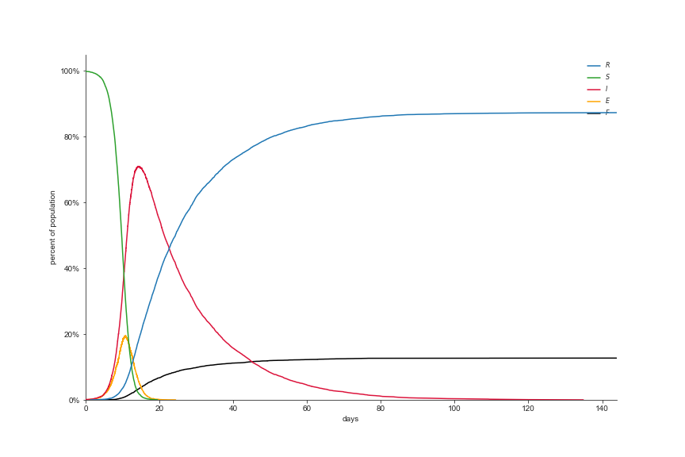

# Network Model for COVID-19 in Moria
By Marcelo Sandoval-Castañeda and Daniel Firebanks-Quevedo. Built using NetworkX and SEIRS+ in Python.

## The Network
A network is designed using NetworkX to represent social and day-to-day interactions in the Moria refugee camp in Lesbos, Greece. Isoboxes to represent houses inside the camp are constructed in a grid of 29 * 28, to which each of the camp inhabitants is assigned to at random, where each isobox contains a maximum of **Poisson(λ=10)** inhabitants. Each inhabitant is represented by a node, that contains the data for the isobox they live in, their ethnicity, thier age, and their gender.

Connections are built using the following rules (from Tucker's paper):
- Connections between inhabitants in the same isobox are assigned with an edge weight of 0.98.
- Connections between inhabitants that live near one another, and are of the same ethnicity, are assigned with an edge weight of 0.017, what we like to call *friendship edges*.
- Lastly, connections regarding the food queue are assigned simulating a FCFS queue, where an individual comes in contact with the five people directly in front of them and the five people directly behind them. These edges are given a weight of 0.407.

Most intervention representations deal with manipulating these edges, whether it is by reducing their weights or by deleting them altogether.

## The Epidemic
As for the simulation of the epidemic, this is done using the SEIRS+ model. Our initial network is assigned to the model, after which arbitrarily many different graphs can be assigned to it, allowing us to perform different food queues everyday, or different interventions depending on the time.

Our key parameters are the following:

Variable | Symbol | Value | Source
:---:|:---:|:---:|:---:
Rate of Transmission | β | 1.28 | [López and Rodó](https://www.medrxiv.org/content/10.1101/2020.03.27.20045005v3.full.pdf)
Mean Incubation Period | 1/σ | 5.1 | [Lauer et al.](https://www.acpjournals.org/doi/10.7326/M20-0504)
Mean Infectious Period | 1/γ | 17.85 | [Citation Needed]
Initial Infected Population | I₀ | 10 | 

## Preliminary Results
Running this simulation with only the people that live in the houses (around 8100 people), the results we have found from the SEIRS+ model are the following:



## Interventions
We have modelled four possible interventions to combat COVID-19 in refugee camps: social distancing, quarantine, use of masks, and multiple food queues. Examples of these can be found in the `NetworkModelling.ipynb` notebook.

Both distancing and quarantine graphs can be implemented using the function `remove_edges_from_graph()` inside `network_utils.py`. It takes as parameters a NetworkX graph, the scale (the greater, the more edges are kept), a list of edge labels to be targeted (`['food']` for social distancing within the queue and `['food', 'friendship']` for quarantine), and a minimum number of edges to be kept.

```python
distancing_graph = remove_edges_from_graph(graph_1fq, scale=10, edge_label_list=["food"], min_num_edges=4)
quarantine_graph = remove_edges_from_graph(graph_1fq, scale=2, edge_label_list=["food", "friendship"], min_num_edges=2)
```

The use of masks can be implemented through the `Intervention` class inside `intervention_utils.py`. Through it, we can `.add` an intervention that alters the rate of transmission (β) of our model at a given timestep, which is the intended effect of the use of masks in a pandemic.

```python
interventions = Interventions()
reduction_percentage = 0.5
interventions.add(graph_1fq, 63, beta=transmission_rate*reduction_percentage)
```

Lastly, multiple food queues can be implemented using the fuction `create_multiple_food_queues`, inside `network_utils.py`. This takes a NetworkX graph, the number of food queues to be allocated per block (in the case of Moria, we have identified four main blocks), the weight of the connection to the food queue, a list containing nodes representing people living in each household, and a list of grids representing each of the blocks.

```python
graph_4fq = create_multiple_food_queues(graph, 1, food_weight, nodes_per_struct, [grid_isoboxes, grid_block1, grid_block2, grid_block3])
```

## Launch Docker container for the project
```
make launch-docker
```
